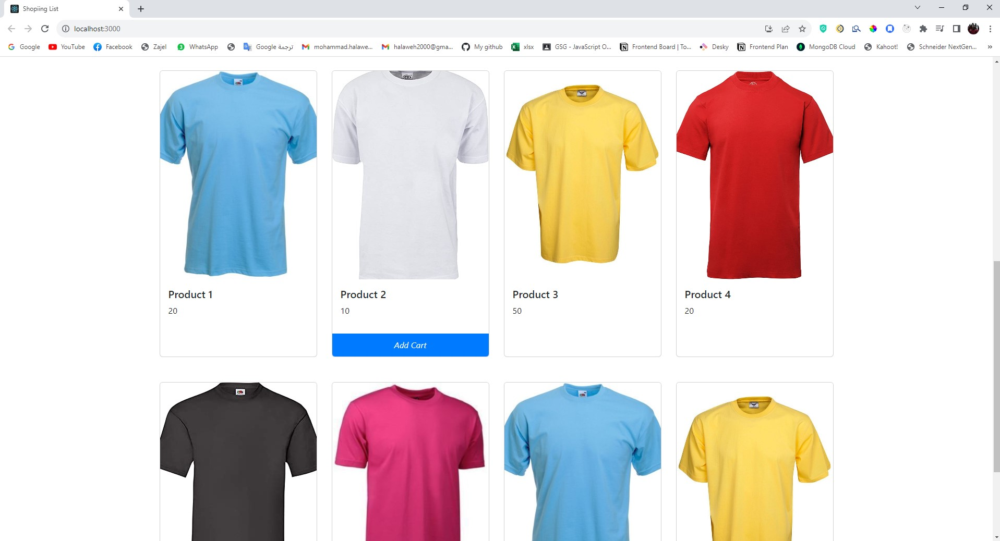
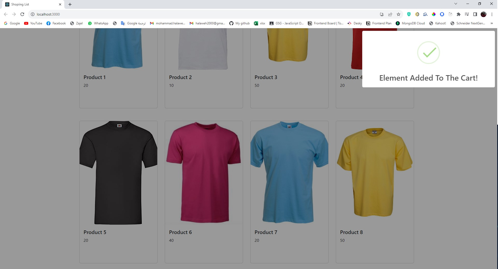
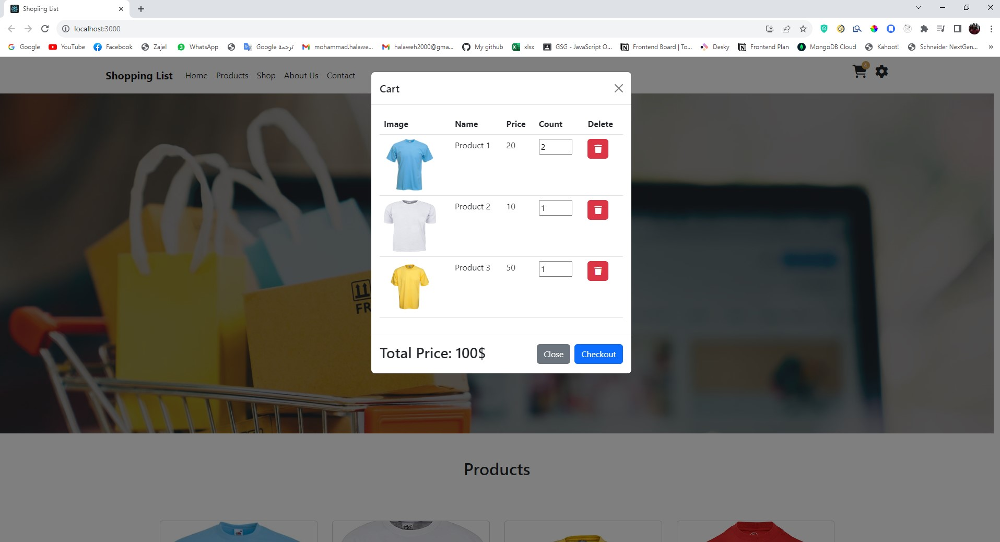
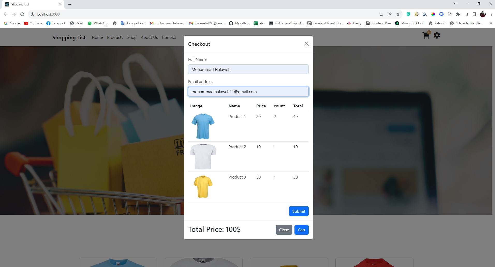
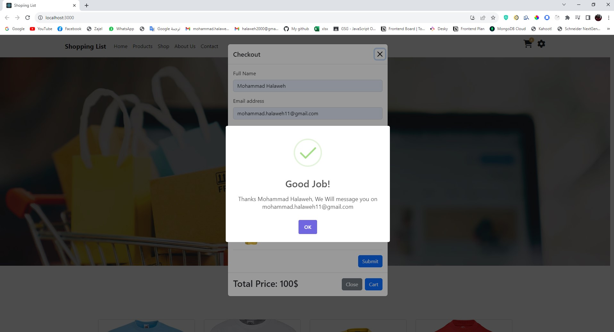

# Shopping-List-React

## Features:

- A grid like list of products where each product has a name/image/price.
- A button to add the product to the cart.
- Cart should have a list of all the items in the cart.
- User can delete an item in the cart.
- Show the total price of the items.
- Checkout form where the user can input his name/email and submit the form.

Tools :
#ReactJs, #local_Storage #html5, #css3, #bootstrap.

## Screenshots

